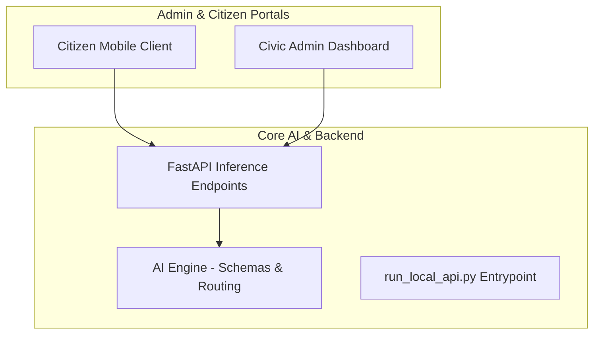

# JanSampark AI — Smart Civic Infrastructure 🏛️🤖

A modular, AI-powered civic issue reporting and administration platform. JanSampark AI connects citizens reporting municipal issues (e.g., potholes, garbage overflow, broken streetlights) directly to administrative departments through automated verification and routing.

---

## 🏗️ Architecture Overview

The system is built across three primary tiers:
1. **AI Pipeline & Backend**: Core computer vision and classification engine with automated departmental routing.
2. **Admin Dashboard**: Real-time management portal for civic authorities to triage and resolve reports.
3. **Citizen Application**: Mobile interface for capturing geotagged, authenticated civic complaints.



---

## 🚀 AI Backend & Local Inference Server

The Python backend provides a high-throughput FastAPI service powered by CLIP zero-shot classification and custom civic issue routing rules.

### Running the Local API Server
```bash
# Activate your virtual environment
.\venv\Scripts\activate

# Launch the FastAPI inference server
python run_local_api.py
```
The server will start on `http://127.0.0.1:8000` (or `http://localhost:8000`).

### Available Endpoints
- `GET /health` — Service health check and loaded model status.
- `POST /analyze-image` — Multipart form-data image upload. Evaluates authenticity, category predictions (pothole, garbage, streetlight, water leakage), and confidence scores.
- `GET /categories` — List of supported civic issue classes and assigned department routes.

---

## 📁 Repository Structure

```text
├── configs/               # Model classifier, detector, and routing configurations
├── jansampark_ai/         # Core AI & backend package
│   ├── backend/           # Server utilities & Firestore bridge
│   ├── configs/           # Configuration loaders
│   ├── export/            # Model export pipelines (TFLite / ONNX)
│   ├── routing/           # Department routing rules
│   ├── schemas/           # Common data schemas & models
│   ├── training/          # Model fine-tuning scripts
│   ├── utils/             # Image & geo processing helpers
│   ├── validation/        # Image integrity and deduplication checks
│   ├── local_api.py       # FastAPI application
│   └── webapp.py          # Local web server interface
├── tests/                 # Unit and integration test suite
├── demo_garbage.png       # Test fixture image (garbage)
├── demo_test_image.png    # Test fixture image (civic issue)
├── run_local_api.py       # Entry point runner script
├── .gitignore
├── README.md
└── requirements.txt
```
