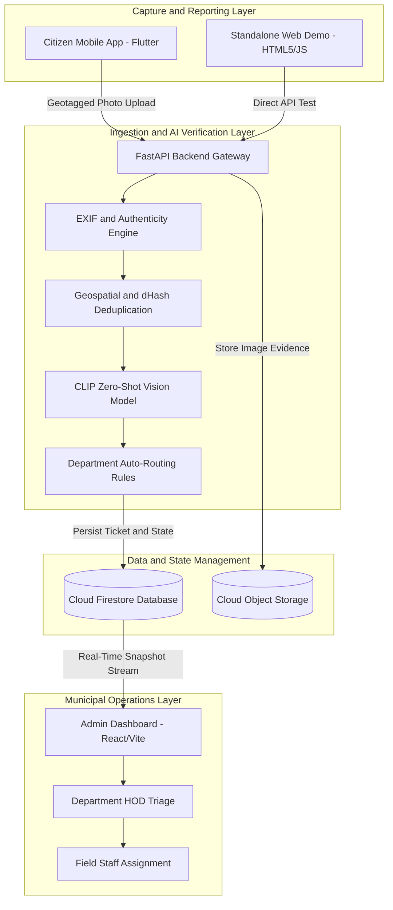
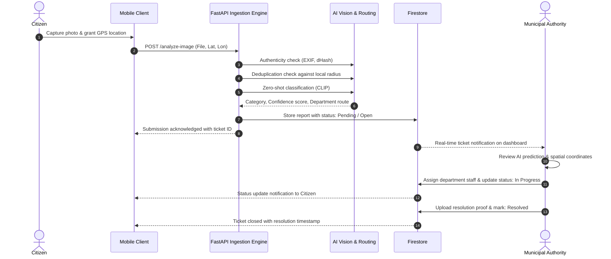

# Public Infrastructure Issue Mapping Platform

A comprehensive, location-aware civic intelligence and infrastructure issue tracking platform. The platform bridges the gap between citizens reporting municipal infrastructure failures and civic authorities responsible for prioritizing, verifying, assigning, and resolving them.

---

## Problem Statement

Municipal corporations and civic administrations frequently face systemic bottlenecks in public infrastructure maintenance:

1. **Unverified and Inaccurate Reporting**: Traditional helplines and portals receive vague descriptions without precise geospatial coordinates or photographic proof.
2. **Duplicate and Redundant Tickets**: A single visible issue (such as a severe pothole or overflowing waste container) often generates dozens of independent reports from passersby, overwhelming call centers and triage teams.
3. **Manual Triage and Routing Delays**: Support staff must manually classify complaints and determine which municipal department (Roads, Sanitation, Electrical, Water Works) holds jurisdiction.
4. **Fraudulent or Reused Images**: Submissions frequently include downloaded images from the internet or photos taken days prior, leading to wasted field inspections.
5. **Lack of Transparency for Citizens**: Citizens submit reports into opaque systems with no visibility into assignment, escalation, or verified resolution.

---

## How This Platform Solves the Problem

The Public Infrastructure Issue Mapping Platform provides an end-to-end, closed-loop solution:

- **Geospatial Issue Mapping**: Captures precise GPS coordinates (latitude, longitude, elevation) directly at the point of capture, mapping civic defects onto an interactive spatial interface for city administrators.
- **Automated Computer Vision Classification**: Leverages zero-shot visual classification (OpenAI CLIP) to inspect images in real time, automatically categorizing issues (Pothole, Garbage Dump, Broken Streetlight, Water Leakage) with confidence scoring.
- **Image Authenticity and Integrity Verification**: Extracts EXIF metadata, timestamp validation, and perceptual difference hashing (dHash) to flag digitally manipulated, recycled, or downloaded imagery before tickets enter administrative queues.
- **Geospatial and Visual Deduplication**: Cross-references new submissions against existing active reports within a spatial radius (e.g., 50 meters) and compares perceptual hashes. If a duplicate is detected, it links to the existing ticket as an upvote rather than creating duplicate work orders.
- **Intelligent Departmental Auto-Routing**: A rule-based routing engine maps detected categories directly to responsible civic departments and pre-assigns priority tiers based on severity.
- **Administrative Triage and SLA Tracking**: A centralized web dashboard gives municipal officers real-time visibility, automated escalation countdowns, interactive map views, and complete audit histories.
- **Closed-Loop Citizen Mobile Experience**: A multi-platform mobile application allows citizens to capture photos, track ticket progression through structured stages (Submitted, Verified, Assigned, In Progress, Resolved), and receive resolution notifications.

---

## System Architecture



---

## Resolution Lifecycle Workflow



---

## Core Subsystems

### 1. AI Verification and Backend Engine (`jansampark_ai/`)

The Python backend delivers high-throughput inference, verification, and database orchestration:

- **`local_api.py`**: The primary FastAPI application providing REST endpoints for image analysis, report retrieval, and system health checks.
- **`run_local_api.py`**: Automated startup runner that validates virtual environments, dependency integrity, and launches Uvicorn.
- **`schemas/common.py`**: Pydantic models standardizing coordinates, submission payloads, verification results, and department structures.
- **`validation/authenticity.py`**: Inspects image headers, camera metadata, and dimensions to filter non-camera synthetic inputs.
- **`validation/hash.py`**: Generates 64-bit perceptual difference hashes (dHash) to identify identical or re-compressed image uploads.
- **`validation/dedup.py`**: Combines spatial haversine distance filtering with Hamming distance comparisons on visual hashes.
- **`routing/department_router.py`**: Matches detected issue categories against configured department responsibilities defined in `configs/routing.default.json`.
- **`configs/`**: YAML/JSON configuration files for detection thresholds, category lists, and department mapping matrices.

### 2. Municipal Admin Dashboard (`smart-civic-system-ak6/smart-civic-admin/`)

A reactive management dashboard built for city officials, department heads, and municipal operators:

- **Role-Based Access Control**: Separate privilege levels for Super Admin, Department Heads (HOD), and Administrative Operators.
- **Live Ticket Stream**: Real-time Firestore synchronization updating ticket lists without manual page refreshes.
- **AI Inspection Modal (`ViewComplaint.jsx`)**: Displays the uploaded photo, extracted GPS map coordinates, detected issue class, model confidence score, and raw inference payload.
- **Triage and Reassignment**: Allows officers to confirm AI classification, override categories, reassign responsible departments, and transition ticket status.
- **SLA Countdown and Escalation**: Visual indicators flagging tickets nearing SLA breach limits.
- **Civic Analytics (`Analytics.jsx`)**: Aggregated metrics on average resolution velocity, department response times, and geographical issue density.

### 3. Citizen Mobile Application (`smart-civic-system-ak6/citizen_app/`)

A cross-platform mobile client built using Flutter:

- **Camera Integration**: Forces live camera capture to guarantee on-site image authenticity.
- **Location Services**: Automatically acquires device GPS latitude, longitude, and accuracy radius.
- **Interactive Issue Map**: Displays ongoing municipal defects in the citizen's neighborhood to prevent redundant reporting.
- **Ticket Progress Tracker**: Step-by-step progress visualizer tracking tickets from submission to resolution.
- **Multilingual Support**: Localization framework enabling regional language accessibility.
- **On-Device Reference (`mobile_reference/`)**: Standalone Dart services demonstrating offline client-side classification and hash generation via `tflite_flutter`.

### 4. Standalone Web Demo Client (`frontend/`)

A lightweight, zero-dependency HTML5/CSS/JavaScript client:

- Provides instant drag-and-drop testing of arbitrary image files against the backend.
- Displays raw response payloads, confidence ratings, and routing decisions.
- Operates directly from the browser or served through the FastAPI root URL.

---

## API Reference

### Health Check
- **Endpoint**: `GET /health`
- **Description**: Returns server status, model loading state, and configuration profiles.
- **Response**:
  ```json
  {
    "status": "healthy",
    "model_loaded": true,
    "device": "cpu",
    "categories_count": 4
  }
  ```

### Analyze Infrastructure Image
- **Endpoint**: `POST /analyze-image`
- **Content-Type**: `multipart/form-data`
- **Parameters**:
  - `image` (File, required): The captured image file (JPEG, PNG).
  - `lat` (Float, required): Latitude of the reported defect.
  - `lon` (Float, required): Longitude of the reported defect.
- **Response**:
  ```json
  {
    "submission": {
      "submission_id": "a1b2c3d4e5f6",
      "lat": 19.0760,
      "lon": 72.8777,
      "timestamp": "2026-10-02T14:45:00Z"
    },
    "verification": {
      "is_authentic": true,
      "is_duplicate": false,
      "duplicate_of": null
    },
    "inference": {
      "predicted_category": "pothole",
      "confidence": 0.942,
      "assigned_department": "Roads & Traffic Infrastructure",
      "priority": "High"
    }
  }
  ```

### Active Reports
- **Endpoint**: `GET /reports`
- **Description**: Retrieves active tracked reports stored in the backend store.

---

## Getting Started

### Prerequisites
- Python 3.10 to 3.12
- Node.js 18+ and npm
- Flutter SDK 3.x (optional, for mobile client)

---

### Backend Setup

1. Open a terminal in the project root:
   ```bash
   python -m venv venv
   ```

2. Activate the virtual environment:
   - On Windows:
     ```bash
     .\venv\Scripts\activate
     ```
   - On Linux/macOS:
     ```bash
     source venv/bin/activate
     ```

3. Install required packages:
   ```bash
   pip install -r requirements.txt
   ```

4. Launch the local API server:
   ```bash
   python run_local_api.py
   ```
   The backend will be accessible at `http://127.0.0.1:8000`.

---

### Admin Dashboard Setup

1. Navigate to the admin web application folder:
   ```bash
   cd smart-civic-system-ak6/smart-civic-admin
   ```

2. Install dependencies:
   ```bash
   npm install
   ```

3. Start the Vite development server:
   ```bash
   npm run dev
   ```
   The dashboard will be accessible at `http://localhost:5173`.

---

### Citizen Mobile App Setup

1. Navigate to the citizen mobile app folder:
   ```bash
   cd smart-civic-system-ak6/citizen_app
   ```

2. Fetch Flutter packages:
   ```bash
   flutter pub get
   ```

3. Run on a connected device or emulator:
   ```bash
   flutter run
   ```

---

### Standalone Web Demo Setup

Open `frontend/index.html` directly in any standard web browser, or navigate to `http://127.0.0.1:8000` while the backend is running.

---

## Security and Database Policies

Database access is governed by declarative rules defined in `smart-civic-system-ak6/firestore.rules`:
- Unauthenticated access is rejected across all operational collections.
- Citizens have restricted write permissions limited to issue creation and read permissions for their own submissions.
- Administrative operations (status transitions, assignment, deletion) require authenticated roles (`admin`, `hod`, or `super_admin`) verified against user registry documents.

---

## Verification and Testing

Run automated tests to verify model loading, deduplication heuristics, and API routing:

```bash
pytest tests/
```

---

## Project Structure Reference

```text
├── configs/                     # System configs (classifier, detector, routing)
├── frontend/                    # Standalone HTML/CSS/JS testing interface
├── jansampark_ai/               # Core backend service, AI inference, and validation
│   ├── backend/                 # Database integration
│   ├── configs/                 # Config readers
│   ├── export/                  # Export utilities for mobile models
│   ├── routing/                 # Department allocation logic
│   ├── schemas/                 # Data schemas
│   ├── training/                # Training pipelines
│   ├── utils/                   # Shared image and geo helpers
│   ├── validation/              # Deduplication and authenticity checks
│   ├── local_api.py             # FastAPI REST endpoints
│   └── webapp.py                # Web server integration
├── mobile_reference/            # Offline mobile inference reference logic
├── smart-civic-system-ak6/
│   ├── citizen_app/             # Flutter mobile client for citizens
│   ├── smart-civic-admin/       # React/Vite admin management portal
│   └── firestore.rules          # Firestore security rules
├── tests/                       # Automated test suite
├── demo_garbage.png             # Sample test asset
├── demo_test_image.png          # Sample test asset
├── requirements.txt             # Backend dependencies
├── run_local_api.py             # Backend launch script
└── README.md                    # System documentation
```

---

## License

All rights reserved. Reference implementation for public infrastructure mapping and automated civic intelligence.
