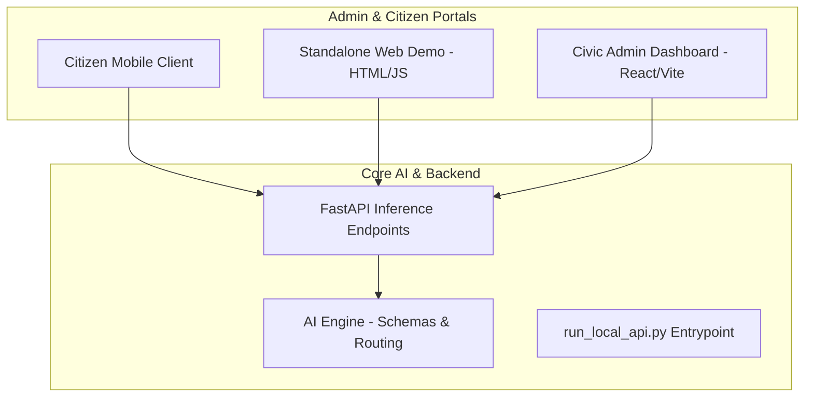

# JanSampark AI — Smart Civic Infrastructure 🏛️🤖

A modular, AI-powered civic issue reporting and administration platform. JanSampark AI connects citizens reporting municipal issues (e.g., potholes, garbage overflow, broken streetlights) directly to administrative departments through automated verification and routing.

---

## 🏗️ Architecture Overview

The system is built across three primary tiers:
1. **AI Pipeline & Backend**: Core computer vision and classification engine with automated departmental routing.
2. **Admin Dashboard**: Real-time management portal for civic authorities to triage, inspect AI confidence scores, and resolve reports.
3. **Citizen Application**: Mobile interface for capturing geotagged, authenticated civic complaints.
4. **Web Demo Portal**: Zero-dependency frontend for rapid testing and demonstrations.



---

## 🚀 AI Backend & Local Inference Server

The Python backend provides a high-throughput FastAPI service powered by CLIP zero-shot classification and custom civic issue routing rules.

### Running the Local API Server
```bash
# Activate your virtual environment
.\venv\Scripts\activate

# Launch the FastAPI inference server
python run_local_api.py
```
The server will start on `http://127.0.0.1:8000`.

---

## 🌐 Standalone Demo Web Portal (`/frontend`)

A lightweight, zero-dependency HTML5/CSS/JavaScript client designed for quick image testing, drag-and-drop analysis, and category prediction inspection.

- **Direct Launch**: Open `frontend/index.html` in any web browser.
- **Integrated Mode**: Served directly through the FastAPI backend at `http://127.0.0.1:8000/`.

---

## 🖥️ Smart Civic Admin Web App

The administrative dashboard provides civic authorities with real-time issue streams, department-wise task allocation, and automated AI image analysis.

### Running the Admin Dashboard
```bash
cd smart-civic-system-ak6/smart-civic-admin

# Install dependencies
npm install

# Start Vite development server
npm run dev
```
The dashboard runs at `http://localhost:5173`.

---

## 🔒 Security & Firestore Rules

`smart-civic-system-ak6/firestore.rules` defines fine-grained access control:
- Citizens can create issues and view public resolutions.
- Admin & HOD roles can update complaint statuses, reassign departments, and close tickets.
- Automated rate limiting and field validation schemas.

---

## 📁 Repository Structure

```text
├── configs/               # Model classifier, detector, and routing configurations
├── frontend/              # Standalone web testing portal (HTML/CSS/JS)
│   ├── app.js
│   ├── index.html
│   └── styles.css
├── jansampark_ai/         # Core AI & backend package
├── smart-civic-system-ak6/
│   ├── firestore.rules    # Firebase security rules
│   └── smart-civic-admin/ # React + Vite Admin Web Dashboard
├── tests/                 # Unit and integration test suite
├── demo_garbage.png       # Test fixture image (garbage)
├── demo_test_image.png    # Test fixture image (civic issue)
├── run_local_api.py       # Entry point runner script
├── .gitignore
├── README.md
└── requirements.txt
```
