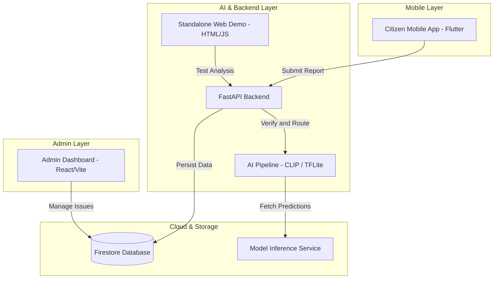

# JanSampark AI - Smart Civic Infrastructure

A modular, AI-powered civic issue reporting and municipal administration platform. JanSampark AI connects citizens reporting municipal issues (such as potholes, garbage accumulation, water leaks, or broken streetlights) directly to administrative departments through automated computer vision verification and routing.

---

## Project Architecture



---

## Repository Structure

```text
├── configs/                     # Model classifier, detector, and routing configurations
│   ├── classifier.yaml
│   ├── detector.yaml
│   ├── export.yaml
│   └── routing.default.json
├── frontend/                    # Standalone zero-dependency web demo client
│   ├── app.js
│   ├── index.html
│   └── styles.css
├── jansampark_ai/               # Core AI & backend package
│   ├── backend/                 # Database bridge and store implementations
│   ├── configs/                 # Config file loaders
│   ├── export/                  # TFLite / ONNX export pipelines
│   ├── routing/                 # Department auto-routing rules
│   ├── schemas/                 # Pydantic schemas and data contracts
│   ├── training/                # Training & fine-tuning routines
│   ├── utils/                   # Geo-spatial, image, and Firestore utilities
│   ├── validation/              # Authenticity, dHash, and deduplication
│   ├── local_api.py             # FastAPI service endpoints
│   └── webapp.py                # Local web server runner
├── mobile_reference/            # Reference Dart services for on-device inference
│   └── lib/
├── smart-civic-system-ak6/
│   ├── citizen_app/             # Flutter cross-platform mobile client
│   ├── smart-civic-admin/       # React + Vite administrative dashboard
│   └── firestore.rules          # Firebase security rules
├── tests/                       # Unit and integration test suite
├── demo_garbage.png             # Test image fixture
├── demo_test_image.png          # Test image fixture
├── run_local_api.py             # Root backend launch script
├── .gitignore
├── README.md
└── requirements.txt
```

---

## Subsystems and Setup

### 1. AI Backend and Inference API (Root)

The core Python service handles image authentication, deduplication, CLIP zero-shot classification, and department routing.

- **Stack**: FastAPI, PyTorch, HuggingFace Transformers (CLIP), Uvicorn.
- **Setup**:
  ```bash
  python -m venv venv
  # Windows:
  .\venv\Scripts\activate
  # Linux/macOS:
  source venv/bin/activate

  pip install -r requirements.txt
  python run_local_api.py
  ```
  The API server starts at `http://127.0.0.1:8000`.

- **Key Endpoints**:
  - `GET /health` - Service status and model availability.
  - `POST /analyze-image` - Accepts multipart image uploads, latitude, and longitude. Returns detected civic category, confidence score, authenticity flags, and routed department.
  - `GET /categories` - List of detectable civic issue categories.
  - `GET /reports` - Retrieve active and tracked issue records.

---

### 2. Smart Civic Admin Web Dashboard

A modern administrative interface for municipal authorities to monitor incoming reports, view AI confidence scores, inspect images, and manage ticket status workflows.

- **Stack**: React 18, Vite, Tailwind CSS, Firebase Firestore / Auth.
- **Setup**:
  ```bash
  cd smart-civic-system-ak6/smart-civic-admin
  npm install
  npm run dev
  ```
  The admin portal starts at `http://localhost:5173`.

---

### 3. Citizen Mobile Application

A cross-platform mobile application for citizens to report municipal issues with geotagged photography and track resolution status in real time.

- **Stack**: Flutter / Dart.
- **Setup**:
  ```bash
  cd smart-civic-system-ak6/citizen_app
  flutter pub get
  flutter run
  ```

---

### 4. Standalone Web Demo Portal

A zero-dependency HTML5/CSS/JavaScript client for testing the AI classification engine without needing the mobile or admin setup.

- **Direct Usage**: Open `frontend/index.html` directly in any web browser.
- **Integrated Mode**: Served through the FastAPI backend root at `http://127.0.0.1:8000/`.

---

### 5. Security and Database Rules

`smart-civic-system-ak6/firestore.rules` enforces role-based access control:
- Citizens can create issues and view public resolutions.
- Admin and HOD personnel can update status, assign departments, and add official remarks.
- Strict schema validation for geolocation and report payloads.

---

## Testing

Run the test suite from the repository root:
```bash
pytest
```

---

## License

Python-first reference implementation used by JanSampark. All rights reserved.
