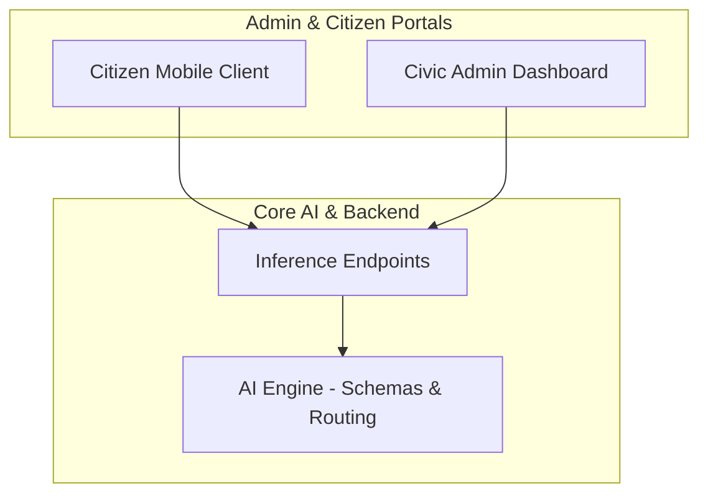

# JanSampark AI — Smart Civic Infrastructure 🏛️🤖

A modular, AI-powered civic issue reporting and administration platform. JanSampark AI connects citizens reporting municipal issues (e.g., potholes, garbage overflow, broken streetlights) directly to administrative departments through automated verification and routing.

---

## 🏗️ Architecture Overview

The system is built across three primary tiers:
1. **AI Pipeline & Backend**: Core computer vision and classification engine with automated departmental routing.
2. **Admin Dashboard**: Real-time management portal for civic authorities to triage and resolve reports.
3. **Citizen Application**: Mobile interface for capturing geotagged, authenticated civic complaints.



---

## 📁 Repository Structure (Initial Setup)

```text
├── configs/               # Model classifier, detector, and routing configurations
│   ├── classifier.yaml
│   ├── detector.yaml
│   ├── export.yaml
│   └── routing.default.json
├── jansampark_ai/         # Core AI package
│   ├── configs/           # Configuration loaders
│   ├── routing/           # Department routing rules
│   ├── schemas/           # Common data schemas & models
│   ├── utils/             # Helper utilities
│   └── validation/        # Image integrity and deduplication checks
├── tests/                 # Unit test suite
├── .gitignore
├── README.md
└── requirements.txt
```

---

## 🚀 Setup & Installation

1. Create and activate a Python virtual environment:
   ```bash
   python -m venv venv
   # Windows
   .\venv\Scripts\activate
   # Linux/macOS
   source venv/bin/activate
   ```

2. Install dependencies:
   ```bash
   pip install -r requirements.txt
   ```

3. Run verification tests:
   ```bash
   pytest
   ```
